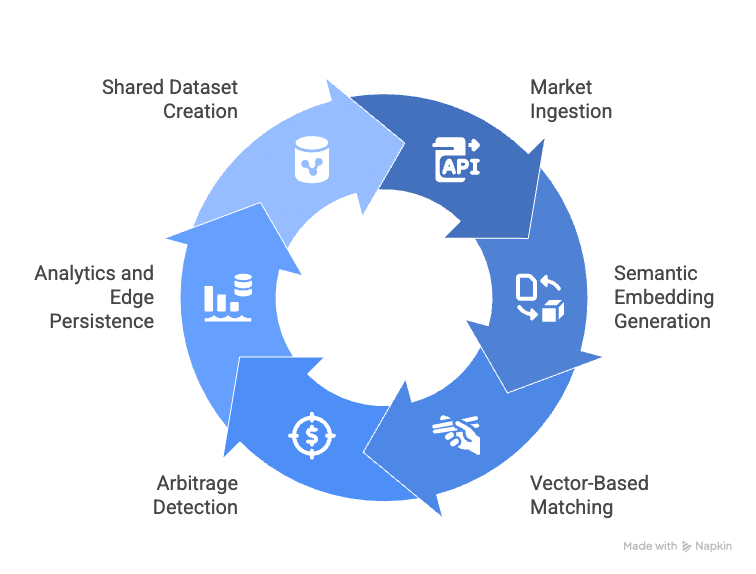
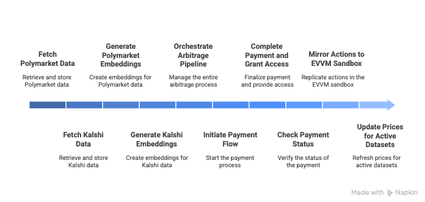
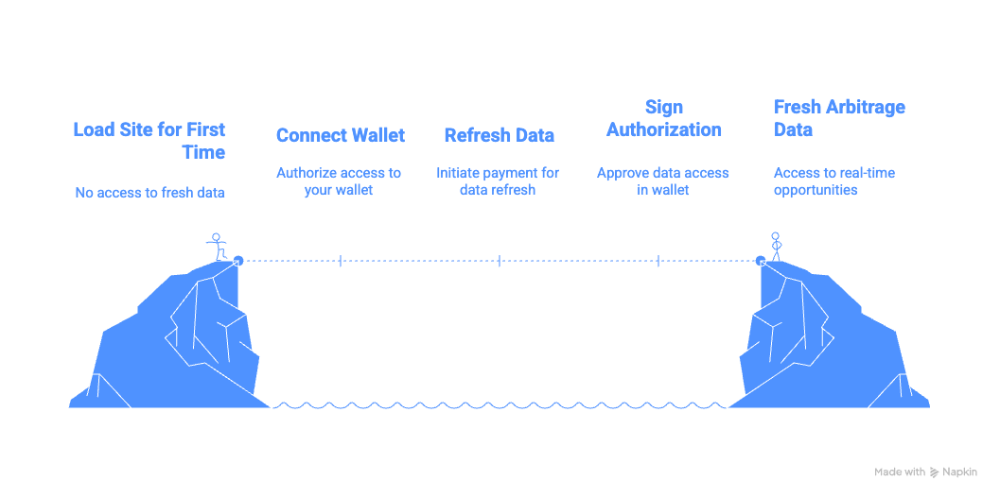

# EdgeFinder

[](https://x402.org)
[](https://chain.link)
[](https://thegraph.com/amp)
[](https://evvm.org)
[](https://arbitrum.io)
[](https://supabase.com)


Real-time arbitrage detection for prediction markets powered by semantic vector search. EdgeFinder uses AI-driven market matching to identify price discrepancies between Polymarket and Kalshi that traditional keyword-based systems miss, enabling traders to capture risk-free profit opportunities across platforms.

Prediction markets often price the same event differently due to liquidity fragmentation, information asymmetry, and platform-specific user bases. EdgeFinder's semantic engine analyzes market questions beyond surface-level text, matching equivalent events even when platforms use different wording, structure, or phrasing. This reveals inefficiently priced markets that would otherwise remain hidden.

> [!TIP]
> EdgeFinder leverages the following technologies to provide a trustless, decentralized arbitrage detection system:

 **Pay-Per-Use Access**: No subscriptions or accounts required. Pay $1 USDC via x402 protocol to access fresh arbitrage data from the shared dataset.

 **Trust-Minimized Infrastructure**: Built on Supabase Edge Functions with Chainlink CRE workflows ready to be deployed for decentralized, consensus-driven data fetching. CRE workflows run on Chainlink's DON with cryptographic verification, eliminating single points of failure and enabling verifiable onchain data writes for transparent arbitrage opportunities.

 **Amp Integration**: Leverages The Graph Amp for time-series analytics and edge persistence tracking, storing every edge snapshot for historical analysis and pattern recognition.

 **Gasless Payment Sandbox**: Integrates EVVM Sandbox on Sepolia to provide gasless, risk-free testing of dataset refresh workflows. Users can preview x402 payment intents in a virtual environment without spending real funds, enabling safe experimentation with the payment protocol before executing onchain transactions.

## Architecture

### Data Pipeline

The system operates through a multi-stage pipeline that runs hourly:

<p align="center">
  <picture>
    <source media="(prefers-color-scheme: dark)" srcset="./readme-images/data_pipeline_dark.png">
    <source media="(prefers-color-scheme: light)" srcset="./readme-images/data_pipeline.png">
    
  </picture>
</p>

**Market Ingestion**: Supabase Edge Functions fetch open markets from Polymarket and Kalshi APIs, filtering for active political prediction markets. Chainlink CRE workflows are production-ready and can replace these centralized functions to provide trust-minimized, consensus-driven data fetching.

**Semantic Embedding Generation**: Each market question is transformed into a vector embedding using OpenAI's `text-embedding-3-small` model. The embedding captures semantic meaning from the question text, description, and resolution date.

**Vector-Based Matching**: Custom PostgreSQL functions compute cosine similarity between Polymarket and Kalshi embeddings to identify matching events. The system applies direction alignment logic to ensure both markets predict the same outcome direction.

**Arbitrage Detection**: For each matched pair, the pipeline calculates price spreads and determines optimal trading strategies accounting for platform fees.

**Analytics and Edge Persistence**: Results are stored in The Graph Amp for time-series analysis and historical edge tracking. This enables users to visualize arbitrage opportunities over time and identify recurring patterns.

**Shared Dataset Creation**: Results are stored in a shared dataset table with one-hour expiration, accessible to all users who have paid for current access.

### Supabase Edge Functions

The backend runs entirely on Supabase Edge Functions currently, with Chainlink CRE workflows ready to be deployed as a trust-minimized alternative:

```
supabase/functions/
├── polymarket-open-markets/      # Fetch and persist Polymarket data (ready to be replaced by Chainlink CRE)
├── kalshi-open-markets/          # Fetch and persist Kalshi data (ready to be replaced by Chainlink CRE)
├── polymarket-embedding-generation/  # Generate embeddings for Polymarket
├── kalshi-embedding-generation/      # Generate embeddings for Kalshi
├── arbitrage-pipeline/           # Orchestrate full pipeline
├── x402-start/                   # Initiate payment flow
├── x402-settle/                  # Complete payment and grant access
├── x402-status/                  # Check payment status
├── evvm-mirror-dataset-refresh/  # Mirror x402 actions to EVVM sandbox
└── price-refresh/                # Update prices for active datasets
```

<p align="center">
  <picture>
    <source media="(prefers-color-scheme: dark)" srcset="./readme-images/functions_process_dark.png">
    <source media="(prefers-color-scheme: light)" srcset="./readme-images/functions_process.png">
    
  </picture>
</p>

Each function is independently deployable and can be triggered via HTTP or cron schedule. The market data fetching functions (`polymarket-open-markets` and `kalshi-open-markets`) can be replaced by the production-ready Chainlink CRE workflows in `cre-market-data/` for trust-minimized, consensus-driven data fetching.

### Custom Vector Search

The matching system uses PostgreSQL's vector capabilities with custom similarity functions:

**Cosine Similarity**: Measures semantic similarity between market embeddings (0 to 1 scale).

**Direction Alignment**: Analyzes question phrasing to ensure both markets predict the same outcome. For example, "Will X win?" matches "Will X win?" but not "Will X lose?".

**Confidence Scoring**: Combines similarity score with direction alignment confidence to filter out false matches.

**Best Match Selection**: For each market, only the highest-scoring cross-platform match is marked as the canonical pairing.

The vector search runs entirely in PostgreSQL using stored procedures, avoiding the need for external vector databases.

## Chainlink CRE Integration

The `cre-market-data/` directory contains Chainlink Runtime Environment workflows that provide a trust-minimized alternative to centralized serverless functions.

### Why CRE?

Traditional serverless functions (Vercel, AWS Lambda, Supabase Edge Functions) rely on a single provider to fetch and process data. This creates trust assumptions:

- The provider could manipulate data before serving it
- API responses could be tampered with
- Single points of failure affect reliability
- No cryptographic proof of data origin

Chainlink CRE workflows eliminate these issues through decentralized execution:

**Consensus-Driven**: Multiple independent Chainlink nodes fetch data from source APIs and reach consensus on the result.

**Cryptographically Signed**: The Decentralized Oracle Network (DON) signs aggregated results, providing verifiable proof of origin.

**Onchain Verification**: Results can be written directly to smart contracts with cryptographic attestation.

**No Single Point of Failure**: If one node fails or returns bad data, consensus mechanisms filter it out.

### Current Implementation

Two CRE workflows are production-ready:

**polymarket-open-markets**: Fetches active Polymarket markets every 15 minutes, applies consensus aggregation, and optionally writes execution logs to Arbitrum Sepolia.

**kalshi-open-markets**: Fetches active Kalshi markets every 15 minutes with the same consensus and verification guarantees.

Both workflows are currently in simulation mode but can be deployed to production Chainlink DONs. Once deployed, they will replace the centralized Supabase Edge Functions for market data fetching, providing cryptographic proof that price data comes directly from Polymarket and Kalshi APIs without intermediary manipulation.

See `cre-market-data/README.md` for deployment instructions and technical details.

## The Graph Amp Integration

EdgeFinder leverages Amp from The Graph to power real-time analytics and historical edge tracking. Amp provides a blockchain-native SQL-queryable database for storing and analyzing time-series arbitrage data.

### Why Amp?

Traditional databases require complex infrastructure for time-series analytics on blockchain-related data. Managing historical snapshots, running aggregations, and ensuring data integrity across distributed systems introduces operational overhead. Amp solves these challenges:

**Blockchain-Native Storage**: Edge snapshots are stored in a decentralized, tamper-proof dataset with built-in versioning and cryptographic verification.

**SQL Queryability**: Complex temporal analytics (min/max/avg edge over time, persistence metrics, threshold crossings) are expressed in standard SQL without custom indexing logic.

**Real-Time Performance**: Sub-second query latency enables live analytics dashboards showing edge persistence, stability, and quality scores.

**Multi-Chain Ready**: Amp's architecture supports cross-chain data aggregation, preparing EdgeFinder for future expansion to additional prediction market platforms.

### Current Implementation

Amp powers three key features:

**Edge Snapshot Publishing**: Every arbitrage pipeline run publishes timestamped snapshots to Amp containing opportunity IDs, venue prices, computed edge percentages, and strategy recommendations. This creates a complete historical record of every detected arbitrage opportunity.

**Analytics API**: The `amp-opportunity-analytics` Edge Function queries Amp to compute derived metrics including edge min/max/avg, duration above threshold, sample counts, persistence flags, and composite quality scores. These metrics help traders assess opportunity reliability.

**UI Integration**: Each opportunity card displays an "Amp Edge History" panel showing real-time analytics: how long the edge has been active, average strength, price range stability, and quality labels (Stable, Persistent, Noisy). Users can sort opportunities by Amp-derived edge scores to prioritize high-confidence trades.

The integration operates in two modes: production mode queries live Amp datasets for real historical data, while demo mode generates realistic mock analytics for development and demonstration without requiring Amp infrastructure.

The current implementation utilizes the demo mode as the Amp is still in early developer preview, but it is fully functional and production ready. The production mode can be enabled by setting the appropriate environment variables in the `.env` file and inside the Edge Function configuration on Supabase.

## x402 Payment Protocol

EdgeFinder uses x402, an HTTP-based payment protocol that enables seamless micropayments without user accounts or trusted intermediaries.

### How x402 Works

**Payment Initiation**: User requests access. The app calls `/x402-start` which contacts an x402 facilitator to get payment requirements (amount, token, recipient, deadline).

**EIP-3009 Authorization**: User signs an EIP-3009 `transferWithAuthorization` message in their wallet, authorizing the facilitator to execute a USDC transfer on their behalf. No transaction is broadcast yet.

**Settlement**: The signed authorization is sent to `/x402-settle`. The facilitator verifies the signature, executes the USDC transfer onchain via `transferWithAuthorization`, and returns proof of payment.

**Access Grant**: The backend verifies the onchain transaction and grants the user access to the latest arbitrage dataset.

## EVVM Sandbox Integration

EdgeFinder integrates with **EVVM (Ethereum Virtual Virtual Machine)** via the MATE Metaprotocol on Sepolia to provide a risk-free sandbox environment for previewing x402 dataset refresh intents.

### What is EVVM?

EVVM is infrastructure-less abstract blockchain technology that allows you to create virtual blockchains on top of any existing chain by deploying smart contracts. It provides:

- **Gasless Transactions**: Users don't pay gas for virtual actions
- **Custom Economics**: Services can define their own token models and rewards
- **Async Nonces**: Flexible nonce system for out-of-order execution
- **Executor Pattern**: Separation between intent signers and executors

### Sandbox Features

The EVVM Sandbox allows users to:

1. **Preview Dataset Refresh**: Click "Preview in Sandbox" to create a virtual copy of the $1 USDC dataset refresh intent
2. **No Funds Required**: Sandbox actions don't move real funds or require wallet signatures
3. **On-Chain Verification**: Each preview is recorded on Sepolia via the MATE Metaprotocol (EVVM ID: 2)
4. **Async Nonce System**: Uses timestamp-based async nonces to prevent replay attacks
5. **Executor Transparency**: Shows which executor address submitted the sandbox action

### Technical Implementation

**Smart Contract**: `contracts/EVVMSandboxRegistry.sol` records x402 action intents on Sepolia
- Records: opportunity ID, action hash, async nonce, executor, timestamp
- Deployed at: `0x1ab3AF53DCF61EEeadce08387da85D790AD747d8`
- Uses MATE Metaprotocol (EVVM ID 2, contract: `0x9902984d86059234c3B6e11D5eAEC55f9627dD0f`)

**Edge Function**: `supabase/functions/evvm-mirror-dataset-refresh` 
- Reconstructs x402 action payload
- Generates async nonce
- Writes to EVVM contract using viem
- Stores metadata in Postgres

**Frontend**: 
- Sandbox button on Dashboard (next to purchase button)
- `/sandbox` route shows all sandbox actions
- Real-time notifications with Sepolia transaction links

See `contracts/README.md` for deployment instructions and technical details.

## Frontend Application

The user interface is a mobile-first React application built with:

- **React + TypeScript**
- **Vite**
- **Tailwind CSS**
- **wagmi + viem**
- **React Router**

### User Flow

<p align="center">
  <picture>
    <source media="(prefers-color-scheme: dark)" srcset="./readme-images/user_flow_dark.png">
    <source media="(prefers-color-scheme: light)" srcset="./readme-images/user_flow.png">
    
  </picture>
</p>

1. Connect wallet
2. View dashboard showing last accessed dataset or empty state
3. Click "Refresh Data" to initiate x402 payment flow
4. Sign authorization message in wallet (no gas required)
5. Access granted with countdown timer until the next data refresh
6. Browse arbitrage opportunities with direct links to both platforms
7. Execute trades on Polymarket and Kalshi as the app guides you

## Getting Started

### Prerequisites

- Node.js
- pnpm, npm, or yarn
- Supabase account (for backend)
- Chainlink CRE account (for CRE workflows)
- OpenAI API key (for embeddings)

### Installation

```bash
# Install dependencies
pnpm install

# Copy environment template
cp .env.example .env

# Configure environment variables
# VITE_SUPABASE_URL=your-supabase-url
# VITE_SUPABASE_ANON_KEY=your-anon-key
# OPENAI_API_KEY=your-openai-key

# Start development server
pnpm dev
```

The app runs at `http://localhost:5173`

### Supabase Backend Setup

1. Create a new Supabase project
2. Run migrations in `supabase/migrations/` to create tables and functions
3. Deploy Edge Functions: `supabase functions deploy`
4. Set environment variables in Supabase dashboard
5. Configure cron jobs for hourly pipeline execution

### Frontend Deployment

```bash
# Build frontend
pnpm build

# Deploy to Vercel, Netlify, or any static host
# Backend runs on Supabase Edge Functions
```

## Development

### Project Structure

```
.
├── src/                  # React frontend
│   ├── components/       # UI components
│   ├── routes/           # Page components  
│   ├── lib/              # API clients and utilities
│   └── types.ts          # TypeScript definitions
├── contracts/            # EVVM smart contracts
│   ├── EVVMSandboxRegistry.sol  # Sandbox action registry
│   └── README.md         # Contract documentation
├── supabase/
│   ├── functions/        # Edge Functions (Deno)
│   └── migrations/       # SQL migrations
├── cre-market-data/      # Chainlink CRE workflows
│   └── workflows/        # Polymarket and Kalshi workflows
```

### Environment Variables

Refer to the `.env.example` file for all required environment variables.

## Where This Project Is Going Next

**Chainlink CRE Production Deployment**: Replace Supabase Edge Functions with CRE workflows for trust-minimized data fetching

**The Graph Amp Production Integration**: Leverage The Graph's Amp protocol for decentralized data indexing and retrieval in production use. The core functionality is production ready and awaiting access to the early developer preview program.

**Multi-Platform Support**: Expand beyond Polymarket and Kalshi to include other prediction markets

## License

See [LICENSE](LICENSE).

## Disclaimer

This tool is for informational purposes only. Arbitrage opportunities may disappear quickly due to market movements. Always verify prices on the actual platforms before executing trades. Prediction markets involve financial risk.
